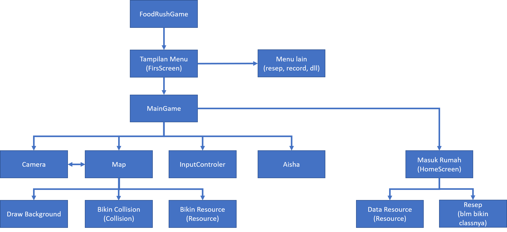

FoodRush Project

ada perubahan kemarin background diem camera gerak sekarang camera dan background yg bergerak aisha yang diem

map gak pale sprite tapi pake satu gamabar png utuh

<strong>Model</strong> 
1. aisha = data tentang aisha
2. Tile = data Tile (posisi x, posisi y, sizeX, sizeY)(kayaknya bakal gak kepake)
3. Collision = data tentang collision (posisi x, posisi y, sizeX, sizeY)
4. Resource = data tentang resource ( blm disis)
5. SoundEffect = <strong>OLGA tolong diisi</strong> 

<strong>View</strong>
1. Map
2. FirstScreen = tampilan pertama kali muncul (menu awal yg foodrush play, <strong>kalo udah ngisi sound isi ini juga ya OLGA</strong>)
3. Camera = seting camera (sementara fix)

<strong>Controller</strong>
1. Maingame = class yng buat ngatur saat aisha diluar 
2. HouseSreen = tampilan dalam rumah yg masak (<strong>Yogi kupercayakan kepadamu</strong>)

<strong>Alur</strong>
